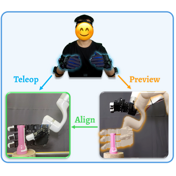

Hello and welcome to my page! I'm a first year master student from [School of Computing](https://www.comp.nus.edu.sg/), [National University of Singapore](https://nus.edu.sg/), advised by [Prof. Lin Shao](https://linsats.github.io/). Before that, I received my Bachelor's degree from [School of Computer Science & Technology](https://cs.bit.edu.cn/), [Beijing Institute of Technology](https://www.bit.edu.cn/).

My research interest includes Robotics and machine learning.

[CV](../assets/CV.pdf)

## Publications

  
  

    <a href="https://telepreview.github.io/" style="font-weight: bold; font-size: 1.2em; text-decoration: none;">
      TelePreview: A User-Friendly Teleoperation System with Virtual Arm Assistance for Enhanced Effectiveness
    </a>
     
    

      <i>Jingxiang Guo*</i>, <b>Jiayu Luo*</b>, Zhenyu Wei*, Yiwen Hou, Zhixuan Xu, Xiaoyi Lin, Chongkai Gao, Lin Shao 
      <i>In Submission to RA-L</i>
    

    <a href="https://telepreview.github.io/static/data/paper.pdf">paper</a> | 
    <a href="https://telepreview.github.io/">project</a> | 
    <a href="https://www.youtube.com/watch?v=k6KpkKWzuqs&t=1s">video</a>
  

  
  

    <a href="https://nus-lins-lab.github.io/drograspweb/" style="font-weight: bold; font-size: 1.2em; text-decoration: none;">
      D(R,O) Grasp: A Unified Representation of Robot and Object Interaction for Cross-Embodiment Dexterous Grasping
    </a>
     
    

      <i>Zhenyu Wei</i>, Zhixuan Xu, Jingxiang Guo, Yiwen Hou, Yiwen Hou, Chongkai Gao, Zhehao Cai, <b>Jiayu Luo</b>, Lin Shao 
      <i>Best Robotics Paper Award, CoRL 2024 @ MAPoDeL</i>
    

    <a href="https://arxiv.org/abs/2410.01702">paper</a> | 
    <a href="https://nus-lins-lab.github.io/drograspweb/">project</a> | 
  

