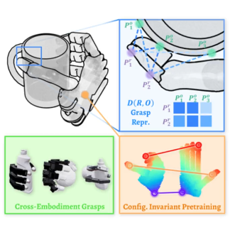

Hello and welcome to my page! I'm a first year master student from [School of Computing](https://www.comp.nus.edu.sg/), [National University of Singapore](https://nus.edu.sg/), advised by [Prof. Lin Shao](https://linsats.github.io/). Before that, I received my Bachelor's degree from [School of Computer Science & Technology](https://cs.bit.edu.cn/), [Beijing Institute of Technology](https://www.bit.edu.cn/).

My research interest includes Robotics and machine learning.

## Publications

###  [TelePreview: A User-Friendly Teleoperation System with Virtual Arm Assistance for Enhanced Effectiveness](https://telepreview.github.io/)
*Jingxiang Guo\*, __Jiayu Luo__\*, Zhenyu Wei\*, Yiwen Hou, Zhixuan Xu, Xiaoyi Lin, Chongkai Gao, Lin Shao*  
*In Submission to RA-L*  
[paper](https://telepreview.github.io/static/data/paper.pdf) | [project](https://telepreview.github.io/) | [video](https://www.youtube.com/watch?v=k6KpkKWzuqs&t=1s)

###  [D(R,O) Grasp: A Unified Representation of Robot and Object Interaction for Cross-Embodiment Dexterous Grasping](https://nus-lins-lab.github.io/drograspweb/)
*Zhenyu Wei\*, Zhixuan Xu\*, Jingxiang Guo, Yiwen Hou, Chongkai Gao, Zhehao Cai, __Jiayu Luo__, Lin Shao*  
*Best Robotics Paper Award, CoRL 2024 @ MAPoDeL*  
[paper](https://arxiv.org/abs/2410.01702) | [project](https://nus-lins-lab.github.io/drograspweb/)
